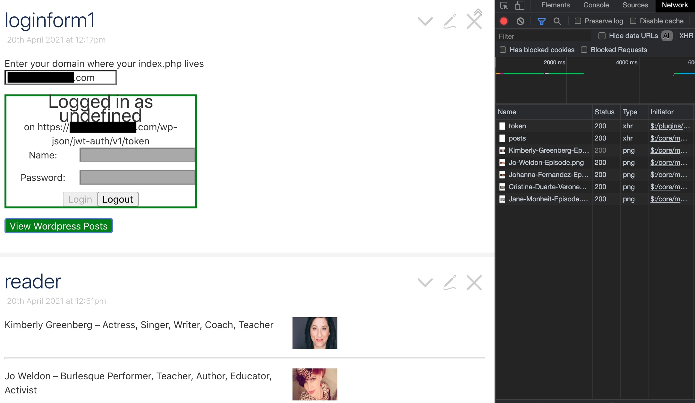

# What is it? 

1. Technically: A single-page HTML file that can talk to the Wordpress API. 
2. Effectively: A potential replacement for the Wordpress backend for some publishers/tasks.  

# Who is it for? 

1. In Development: People who want to make custom Wordpress backend views/actions; people who want to integrate Tiddlywiki with a stable backend. 

2. In Practice: People who find the Wordpress backend slow or confusing; people who want to power-up the backend by using Tiddlywiki to string together content and create unique posts with less manual labor (think SEOs who want to create/update lots of content and metadata at once in Wordpress). 

# Getting Started

From this repository you need only the `talk.html` to get started; but there is an important  prerequisite within Wordpress, you need to follow the steps to install the [JWT Authentication for WP-API](https://wordpress.org/plugins/jwt-authentication-for-wp-rest-api/).

Once you're done with that, you can just drop the `talk.html` file from the `output/` directory of this repository into whatever directory houses your Wordpress index.php file. Then simply navigate to [yourdomain]/talk.html and login to Wordpress.

## Prerequisites 

1. A site running Wordpress and the ability to upload the talk.html file. 
2. The WP API plugin installed and configured as per the instructions. 

## Doing your own thing with it

This tool was created in [Tiddlywiki](https://tiddlywiki.com) (TW5). If you know Tiddlywiki, you can clone this repository and interact with the .tid files directly; you can also swap the names of the two "tiddlywiki info" files and, from a shell in this directory, run `tiddlywiki --listen port=8089` to run Tiddlywiki locally (on port 8089) and interact with it in the browser. 

This wiki uses a combination of the following plugins:

1. LOGIN - Jed (@inmysocks) @Ooktech makes a killer extension of Tiddlywiki called Bob, which adds multi-user functionality to Tiddlywiki -- his Login plugin, [TW5-Login](https://github.com/OokTech/TW5-Login) is a precursor/component of Bob, and is used to send a request to Wordpress for a token, then store the token in cookies and localstorage. 

1. GET WP DATA - Paulin in [this thread](https://groups.google.com/g/tiddlywiki/c/E_X3KUHOvEk/m/ucL23ju5AAAJ) shared his elegant AJAX script to fetch some data with a get request and create a tiddler out of it. This is modified only slightly so it will fetch json instead of markdown. *NOTE* when TW reads the data from the GET request, it takes the image url from `jetpack_featured_media_url`, which won't be present 

2. SEND WP DATA - Jed at Ooktech strikes again with his straightforward POST request from tiddlywiki in [TW5-SubmitForm](https://github.com/OokTech/TW5-SubmitForm). I have modified it slightly for posting json payloads instead of url params. So far I have only updated "published date" of a post for scheduling... ultimately I would like to be able to do everything the API can accommodate, especially inserting things into Gutenberg blocks. 

3. MANIPULATE DATA - @joshuafontany opens up a world of possibilities for Tiddlywiki users with his [jsonmangler](https://github.com/joshuafontany/TW5-JsonMangler) plugin, which allows us to handle nested json in Tiddlywiki (TW5 only supports flat json without this plugin, which limits AJAX functionality in TW5). 

# To-Do

1. Clean up the basics for reading data, add non-Jetpack image fields (GET requests)

2. Add some write functionality (POST requests) 

3. Add routes to Wordpress and corresponding TW code to actually create posts and the associated Gutenberg and Yoast data. 